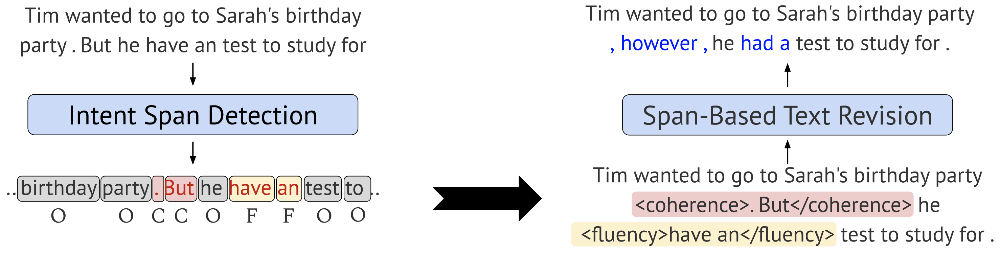

# IteraTeR, R3 System, and DElIteraTeR

This repository provides datasets and code for preprocessing, training and testing models for Iterative Text Revision (IteraTeR) with the official Hugging Face implementation of the following paper:

> [Understanding Iterative Revision from Human-Written Text](https://aclanthology.org/2022.acl-long.250/) <br>
> [Wanyu Du](https://github.com/wyu-du), [Vipul Raheja](https://github.com/vipulraheja), [Dhruv Kumar](https://github.com/ddhruvkr), [Zae Myung Kim](https://github.com/zaemyung), [Melissa Lopez](https://github.com/mlsabthlpz), and [Dongyeop Kang](https://github.com/dykang) <br>
> [ACL 2022](https://www.2022.aclweb.org/) <br>

[](https://www.youtube.com/watch?v=peRc2SE31OQ)

The repository also contains the code and data of the following system demo paper, where `IteraTer` pipeline is used in tandem with human writers to facilitate the ease of text revision process:

> [Read, Revise, Repeat: A System Demonstration for Human-in-the-loop Iterative Text Revision](https://aclanthology.org/2022.in2writing-1.14/) <br>
> [Wanyu Du<sup>1](https://github.com/wyu-du), [Zae Myung Kim<sup>1](https://github.com/zaemyung), [Vipul Raheja](https://github.com/vipulraheja), [Dhruv Kumar](https://github.com/ddhruvkr), and [Dongyeop Kang](https://github.com/dykang) <br>
> [First Workshop on Intelligent and Interactive Writing Assistants (ACL 2022)](https://in2writing.glitch.me/) <br>

[](https://www.youtube.com/watch?v=myBJiAl2jcg)
[](https://www.youtube.com/watch?v=lK08tIpEoaE)

We have also released code, datasets, and pretrained models used in `DELineate-Edit-Iterate (DElIteraTeR)` system, an improved version of our previous `IteraTeR` system. Details can be found in the following paper:

> [Improving Iterative Text Revision by Learning Where to Edit from Other Revision Tasks](https://aclanthology.org/2022.emnlp-main.678/) <br>
> [Zae Myung Kim](https://github.com/zaemyung), [Wanyu Du](https://github.com/wyu-du), [Vipul Raheja](https://github.com/vipulraheja), [Dhruv Kumar](https://github.com/ddhruvkr), and [Dongyeop Kang](https://github.com/dykang) <br>
> [EMNLP 2022](https://2022.emnlp.org/) <br>

[](https://www.youtube.com/watch?v=pTqYGlip_OQ)

Our code is mainly based on Hugging Face's `transformers` library.


## Installation
The following command installs all necessary packages:
```
pip install -r requirements.txt
```
The project was tested using Python 3.7.


## Hugging Face Integration
We uploaded both our datasets and model checkpoints to Hugging Face's [repo](https://huggingface.co/wanyu). You can directly load our data using `datasets` and load our model using `transformers`.
```python
# load our dataset
from datasets import load_dataset
iterater_dataset = load_dataset("wanyu/IteraTeR_human_sent")
iterater_plus_multi_sent_dataset = load_dataset("zaemyung/IteraTeR_plus", "multi_sent")

# load our model
from transformers import AutoTokenizer, AutoModelForSeq2SeqLM
tokenizer = AutoTokenizer.from_pretrained("wanyu/IteraTeR-PEGASUS-Revision-Generator")
model = AutoModelForSeq2SeqLM.from_pretrained("wanyu/IteraTeR-PEGASUS-Revision-Generator")
```

You can change the following data and model specifications:
- <a target="_blank" href="https://huggingface.co/datasets/wanyu/IteraTeR_human_sent">"wanyu/IteraTeR_human_sent"</a>: sentence-level IteraTeR-HUMAN dataset;
- <a target="_blank" href="https://huggingface.co/datasets/wanyu/IteraTeR_human_doc">"wanyu/IteraTeR_human_doc"</a>: document-level IteraTeR-HUMAN dataset;
- <a target="_blank" href="https://huggingface.co/datasets/wanyu/IteraTeR_full_sent">"wanyu/IteraTeR_full_sent"</a>: sentence-level IteraTeR-FULL dataset;
- <a target="_blank" href="https://huggingface.co/datasets/wanyu/IteraTeR_full_doc">"wanyu/IteraTeR_full_doc"</a>: document-level IteraTeR-FULL dataset;
- <a target="_blank" href="https://huggingface.co/datasets/wanyu/IteraTeR_v2">"wanyu/IteraTeR_v2"</a>: sentence-level IteraTeR_v2 dataset;
- <a target="_blank" href="https://huggingface.co/datasets/zaemyung/IteraTeR_plus">"zaemyung/IteraTeR_plus"</a>: sentence-level (`single_sent`) and multiple-sentence-level (`multi_sent`) IteraTeR_plus dataset;
- <a target="_blank" href="https://huggingface.co/wanyu/IteraTeR-PEGASUS-Revision-Generator">"wanyu/IteraTeR-PEGASUS-Revision-Generator"</a>: PEGASUS model fine-tuned on sentence-level IteraTeR-FULL dataset, see usage example [here](https://huggingface.co/wanyu/IteraTeR-PEGASUS-Revision-Generator#usage);
- <a target="_blank" href="https://huggingface.co/wanyu/IteraTeR-BART-Revision-Generator">"wanyu/IteraTeR-BART-Revision-Generator"</a>: BART model fine-tuned on sentence-level IteraTeR-FULL dataset, see usage example [here](https://huggingface.co/wanyu/IteraTeR-BART-Revision-Generator#usage);
- <a target="_blank" href="https://huggingface.co/zaemyung/DElIteraTeR-PEGASUS-Multi-Sent-Revision-Generator">"zaemyung/DElIteraTeR-PEGASUS-Multi-Sent-Revision-Generator"</a>: PEGASUS model fine-tuned on multiple-sentence-level IteraTeR-plus dataset, see usage example [here](https://huggingface.co/zaemyung/DElIteraTeR-PEGASUS-Multi-Sent-Revision-Generator#usage);


[](https://colab.research.google.com/drive/1qv7b2jJSqqMaYOQ5NRvAvoyDB3gvpwcp?usp=sharing)<br>
We also provided a simple [demo code](https://colab.research.google.com/drive/1qv7b2jJSqqMaYOQ5NRvAvoyDB3gvpwcp?usp=sharing) for how to use them to do iterative text revision.

## IteraTeR (ACL 2022)

### Datasets
You can load our dataset using Hugging Face's `datasets`, and you can also download the raw data in [datasets/](https://github.com/vipulraheja/IteraTeR/tree/main/dataset). <br>
We splited IteraTeR dataset as follows:
<table>
	<tr>
		<th></th>
		<th colspan='3'>Document-level</th>
		<th colspan='3'>Sentence-level</th>
	</tr>
	<tr>
		<th>Dataset</th>
		<th>Train</th>
		<th>Dev</th>
		<th>Test</th>
		<th>Train</th>
		<th>Dev</th>
		<th>Test</th>
	</tr>
	<tr>
		<td>IteraTeR-FULL</td>
		<td>29848</td>
		<td>856</td>
		<td>927</td>
		<td>157579</td>
		<td>19705</td>
		<td>19703</td>
	</tr>
	<tr>
		<td>IteraTeR-HUMAN</td>
		<td>481</td>
		<td>27</td>
		<td>51</td>
		<td>3254</td>
		<td>400</td>
		<td>364</td>
	</tr>
</table>

All data and detailed description for the data structure can be found under [datasets/](https://github.com/vipulraheja/IteraTeR/tree/main/dataset). <br>
Code for collecting the revision history data can be found under [code/crawler/](https://github.com/vipulraheja/IteraTeR/tree/main/code/crawler).


### Models

#### Intent classification model

##### Model checkpoints

| Model         | Dataset        |  Edit-Intention  |  Precision  | Recall |  F1  |
| :-------------|:-------------  | :-----:| :-----:| :-----:| :-----:|
| [RoBERTa](https://huggingface.co/wanyu/IteraTeR-ROBERTA-Intention-Classifier)      | IteraTeR-HUMAN  | Clarity  | 0.75  | 0.63  | 0.69  |
| [RoBERTa](https://huggingface.co/wanyu/IteraTeR-ROBERTA-Intention-Classifier)    | IteraTeR-HUMAN  | Fluency  | 0.74  | 0.86  | 0.80  |
| [RoBERTa](https://huggingface.co/wanyu/IteraTeR-ROBERTA-Intention-Classifier)    | IteraTeR-HUMAN  | Coherence  | 0.29 | 0.36 | 0.32 |
| [RoBERTa](https://huggingface.co/wanyu/IteraTeR-ROBERTA-Intention-Classifier)    | IteraTeR-HUMAN  | Style  | 1.00 | 0.07 | 0.13  |
| [RoBERTa](https://huggingface.co/wanyu/IteraTeR-ROBERTA-Intention-Classifier)    | IteraTeR-HUMAN  | Meaning-changed  | 0.44 | 0.69 | 0.53  |

##### Model training and inference
The code and instructions for the training and inference of the intent classifier model can be found under [code/model/intent_classification/](https://github.com/vipulraheja/IteraTeR/tree/main/code/model/intent_classification).


#### Generation models

##### Model checkpoints

| Model         | Dataset        |  SARI  |  BLEU  | ROUGE-L|  Avg.  |
| :-------------|:-------------  | :-----:| :-----:| :-----:| :-----:|
| [BART](https://huggingface.co/wanyu/IteraTeR-BART-Revision-Generator)      | IteraTeR-FULL  | 37.28  | 77.50  | 86.14  | 66.97  |
| [PEGASUS](https://huggingface.co/wanyu/IteraTeR-PEGASUS-Revision-Generator)   | IteraTeR-FULL  | 37.11  | 77.60  | 86.84  | 67.18  |


##### Model training and inference
The code and instructions for the training and inference of the Pegasus and BART models can be found under [code/model/generation/](https://github.com/vipulraheja/IteraTeR/tree/main/code/model/generation).


## Human-in-the-loop Iterative Text Revision (In2Writing 2022)
This repository also contains the code and data of the [Read, Revise, Repeat: A System Demonstration for Human-in-the-loop Iterative Text Revision](https://arxiv.org/abs/2204.03685).<br>
The `IteraTeR_v2` dataset is larger than `IteraTeR` with around *24K more
unique documents* and *170K more edits*, which is splitted as follows:
<table>
	<tr>
		<th></th>
		<th>Train</th>
		<th>Dev</th>
		<th>Test</th>
	</tr>
	<tr>
		<td>IteraTeR_v2</td>
		<td>292929</td>
		<td>34029</td>
		<td>39511</td>
	</tr>
</table>

**Human-model interaction data in R3**: we also provide our collected human-model interaction data in R3 in [dataset/R3_eval_data.zip](https://github.com/vipulraheja/IteraTeR/tree/main/dataset/R3_eval_data.zip).

## DElIteraTeR (EMNLP 2022)
`DElIteraTeR` is our recent improvement over the `IteraTeR` system through more data (data augmentation and filtering) and more fine-grained modeling (token-level intent classification and span-based generation).

### Datasets
In addition to `IteraTeR_v2` dataset, we performed data augmentation using publicly available datasets for other related downstream tasks to augment edit intents. For example, we used datasets for grammatical error correction for fluency, text simplification for clarity, sentence fusion or splitting for coherence, and formality style transfer for style. Please refer to [our paper](https://aclanthology.org/2022.emnlp-main.678.pdf) for more details.
<table>
	<tr>
		<th></th>
		<th>Train</th>
		<th>Dev</th>
		<th>Test</th>
	</tr>
	<tr>
		<td>IteraTeR_plus_single_sent</td>
		<td>519k</td>
		<td>3k</td>
		<td>45.k</td>
	</tr>
	<tr>
		<td>IteraTeR_plus_multi_sent</td>
		<td>570k</td>
		<td>3k</td>
		<td>54.4k</td>
	</tr>
</table>

### Models

#### Token-Level Intent Span Detection
The main difference to previous `IteraTeR` system is that `DelIteraTeR` is operating at token-level (and thus span-level) as opposed to whole sentence-level, allowing for more fine-grained control in generation. To facilitate this, the token-level intent classification model is applied to plain input sentences to label each input token by one of five edit intents (including `none` class).

```python
import torch
from transformers import AutoTokenizer, AutoModelForTokenClassification

tokenizer = AutoTokenizer.from_pretrained("zaemyung/DElIteraTeR-RoBERTa-Intent-Span-Detector")

# update tokenizer with special tokens
INTENT_CLASSES = ['none', 'clarity', 'fluency', 'coherence', 'style', 'meaning-changed']  # `meaning-changed` is not used
INTENT_OPENED_TAGS = [f'<{intent_class}>' for intent_class in INTENT_CLASSES]
INTENT_CLOSED_TAGS = [f'</{intent_class}>' for intent_class in INTENT_CLASSES]
INTENT_TAGS = set(INTENT_OPENED_TAGS + INTENT_CLOSED_TAGS)
special_tokens_dict = {'additional_special_tokens': ['<bos>', '<eos>'] + list(INTENT_TAGS)}
tokenizer.add_special_tokens(special_tokens_dict)

model = AutoModelForTokenClassification.from_pretrained("zaemyung/DElIteraTeR-RoBERTa-Intent-Span-Detector")

id2label = {0: "none", 1: "clarity", 2: "fluency", 3: "coherence", 4: "style", 5: "meaning-changed"}

before_text = '<bos>I likes coffee?<eos>'
model_input = tokenizer(before_text, return_tensors='pt')
model_output = model(**model_input)
softmax_scores = torch.softmax(model_output.logits, dim=-1)
pred_ids = torch.argmax(softmax_scores, axis=-1)[0].tolist()
pred_intents = [id2label[_id] for _id in pred_ids]

tokens = tokenizer.convert_ids_to_tokens(model_input['input_ids'][0])

for token, pred_intent in zip(tokens, pred_intents):
    print(f"{token}: {pred_intent}")

"""
<s>: none
<bos>: none
I: fluency
Ġlikes: fluency
Ġcoffee: none
?: none
<eos>: none
</s>: none
"""
```

#### Span-Based Text Revision
Given the edit intent spans identified by the intent span detection model, the standard seq2seq revision model generates revisions for those spanning texts.

```python
from transformers import AutoTokenizer, AutoModelForSeq2SeqLM

tokenizer = AutoTokenizer.from_pretrained("zaemyung/DElIteraTeR-PEGASUS-Multi-Sent-Revision-Generator")
model = AutoModelForSeq2SeqLM.from_pretrained("zaemyung/DElIteraTeR-PEGASUS-Multi-Sent-Revision-Generator")

before_inputs = [
    "<bos>These were known as temple rings <coherence>. They</coherence> were worn on the head, near the temples of a woman or a girl.<eos>",
    "Andrew Hendy, Hereditary Chief of the Miskitu Nation.<bos> <clarity>Proclaimed</clarity> by the Nicaraguans on the death of his cousin George V, who died on 8th November 1888.<eos> He was repudiated by many people of the Miskitu Nation and abdicated in favour of his cousin Jonathan I, on 8th March 1889. He retired to Nicaraguan territory where he became a Miskitu Jefe Inspector and River Magistrate."
]
model_inputs = tokenizer(before_inputs, return_tensors='pt', padding=True)
model_outputs = model.generate(**model_inputs, num_beams=8, max_length=1024)
after_texts = tokenizer.batch_decode(model_outputs, skip_special_tokens=True)

print(after_texts)
# 'These were known as temple rings because they were worn on the head, near the temples of a woman or a girl.',
# 'Andrew Hendy, Hereditary Chief of the Miskitu Nation. He was proclaimed by the Nicaraguans on the death of his cousin George V, who died on 8th November 1888. He was repudiated by many people of the Miskitu Nation and abdicated in favour of his cousin Jonathan I, on 8th March 1889. He retired to Nicaraguan territory where he became a Miskitu Jefe Inspector and River Magistrate.']
```

## Citation
If you find this work useful for your research, please cite our papers:

#### Understanding Iterative Revision from Human-Written Text
```
@inproceedings{du-etal-2022-understanding-iterative,
    title = "Understanding Iterative Revision from Human-Written Text",
    author = "Du, Wanyu  and
      Raheja, Vipul  and
      Kumar, Dhruv  and
      Kim, Zae Myung  and
      Lopez, Melissa  and
      Kang, Dongyeop",
    booktitle = "Proceedings of the 60th Annual Meeting of the Association for Computational Linguistics (Volume 1: Long Papers)",
    month = may,
    year = "2022",
    address = "Dublin, Ireland",
    publisher = "Association for Computational Linguistics",
    url = "https://aclanthology.org/2022.acl-long.250",
    pages = "3573--3590"
}
```


#### Read, Revise, Repeat: A System Demonstration for Human-in-the-loop Iterative Text Revision
```
@inproceedings{du-etal-2022-read,
    title = "Read, Revise, Repeat: A System Demonstration for Human-in-the-loop Iterative Text Revision",
    author = "Du, Wanyu  and
      Kim, Zae Myung  and
      Raheja, Vipul  and
      Kumar, Dhruv  and
      Kang, Dongyeop",
    booktitle = "Proceedings of the First Workshop on Intelligent and Interactive Writing Assistants (In2Writing 2022)",
    month = may,
    year = "2022",
    address = "Dublin, Ireland",
    publisher = "Association for Computational Linguistics",
    url = "https://aclanthology.org/2022.in2writing-1.14",
    pages = "96--108"
}
```

#### Improving Iterative Text Revision by Learning Where to Edit from Other Revision Tasks
```
@inproceedings{kim-etal-2022-improving,
    title = "Improving Iterative Text Revision by Learning Where to Edit from Other Revision Tasks",
    author = "Kim, Zae Myung  and
      Du, Wanyu  and
      Raheja, Vipul  and
      Kumar, Dhruv  and
      Kang, Dongyeop",
    booktitle = "Proceedings of the 2022 Conference on Empirical Methods in Natural Language Processing",
    month = dec,
    year = "2022",
    address = "Abu Dhabi, United Arab Emirates",
    publisher = "Association for Computational Linguistics",
    url = "https://aclanthology.org/2022.emnlp-main.678",
    pages = "9986--9999",
}
```

